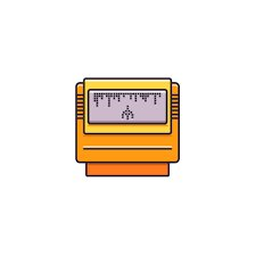

# CARTRIDGE

A free, open-source desktop emulator for Windows. Drag a ROM in, it plays.



## Supported Systems

| System | Extensions |
|--------|-----------|
| Nintendo NES | `.nes` |
| Super Nintendo | `.smc` `.snes` `.sfc` |
| Nintendo 64 | `.n64` `.z64` `.v64` |
| GameCube | `.iso` `.gcm` `.gcz` `.rvz` |
| Nintendo Wii | `.wbfs` `.wad` |
| Game Boy Advance | `.gba` |
| Game Boy Color | `.gbc` |
| Game Boy | `.gb` |
| Virtual Boy | `.vb` |
| Sega Master System | `.sms` `.sg` |
| Sega Game Gear | `.gg` |
| Sega Genesis / Mega Drive | `.md` `.gen` `.smd` `.bin` |
| Sega CD | `.cue` `.chd` |
| TurboGrafx-16 / PC Engine | `.pce` `.pcx` |
| Neo Geo Pocket / Color | `.ngp` `.ngc` |
| WonderSwan / Color | `.ws` `.wsc` |
| ColecoVision | `.col` `.cv` |
| Atari Lynx | `.lnx` `.lyx` |
| Atari 2600 | `.a26` |
| Atari 7800 | `.a78` |

> **N64:** Runs via native [mupen64plus](https://mupen64plus.org) — full-speed dynarec, Bluetooth/USB controllers, save states all handled by mupen in its own window. Close mupen → CARTRIDGE returns automatically.
> **GameCube / Wii:** Runs via native [Dolphin](https://dolphin-emu.org) with full GUI, save states, and controller config.

## Features

- Drag and drop ROMs — automatic system detection
- Game library with search and system filtering
- Save states (F5 to save, F9 to load)
- Keyboard remapping
- Controller support with hot-plug detection
- 100% offline — all cores bundled, no internet required after install
- Clean dark UI

## Installation

Download the latest installer from [Releases](../../releases) and run it. No setup required.

> **Note:** Windows may show a SmartScreen warning on first launch. Click **More info → Run anyway**. This happens because the app isn't code-signed with a paid certificate.

## Building from Source

**Requirements:** Node.js 18+, npm

```bash
git clone https://github.com/YOUR_USERNAME/cartridge.git
cd cartridge
npm install
npm run download-cores
npm start
```

### Build installer

```bash
npm run build
```

Output: `dist/CARTRIDGE Setup 0.2.0.exe`

Run as Administrator the first time to allow electron-builder to extract its build tools.

## Tech Stack

- [Electron](https://electronjs.org) — desktop shell
- [EmulatorJS](https://emulatorjs.org) — WASM emulator cores
- [sql.js](https://sql.js.org) — SQLite via WebAssembly

## Emulator Cores

| System | Core |
|--------|------|
| NES | FCEUmm |
| SNES | Snes9x |
| N64 | Mupen64Plus Next |
| GBA / GBC / GB | mGBA |
| Genesis | Genesis Plus GX |
| Atari 2600 | Stella 2014 |
| Atari 7800 | ProSystem |

## License

GPL-3.0 — see [LICENSE](LICENSE)
